**APPENDIX B**

# 파일을 저장하기 위한 S3 설정 및 사용 방법

***지난 2020년 11월 11일, Amazon S3 콘솔의 UI 가 업데이트 되었습니다. 현재 책에 있는 방법을 보고 따라할 경우 S3를 설정하는데 어려울 수 있습니다. 이에 별도로 페이지를 만들어 독자에게 제공합니다.***

Amazon S3는 AWS 의 파일 스토리지 시스템입니다. 이 책에서 세이지메이커에서 데이터 파일을 생성한 후 S3를 사용하여 머신러닝 및 머신러닝 모델을 위한 파일을 저장합니다. 부록 B 에서는 이 책의 예제 코드를 보관할 S3 버킷을 설정하는 방법을 안내합니다. 아직 AWS 에 가입하 지 않았다면 부록 A 를 참고하기 바랍니다.

AWS 콘솔에 로그인하려면 http://console.aws.amazon.com 으로 이동하여 이메일 주소와 암호를 입력합니다. 로그인하면 AWS 서비스 제목이 표시됩니다. AWS 서비스 아래의 텍스트 상자에 S3 를 입력하고 `Enter` 를 누르면 S3 서비스를 찾을 수 있습니다.

AWS 는 버킷bucket 이라는 개념을 사용하여 파일을 저장하는 위치를 식별합니다. S3를 이용하기 위해 가장 먼저 해야 할 작업은 이 책의 파일을 저장할 버킷을 설정하는 것입니다. 이미 버킷을 생성한 경우 S3 로 이동하면 여러분 버킷을 보여주는 버킷 목록이 표시됩니다 (그림 B-1).

**그림 B-1** 이 책에서 사용하는 코드 및 데이터를 저장하는 데 사용하는 S3 버킷

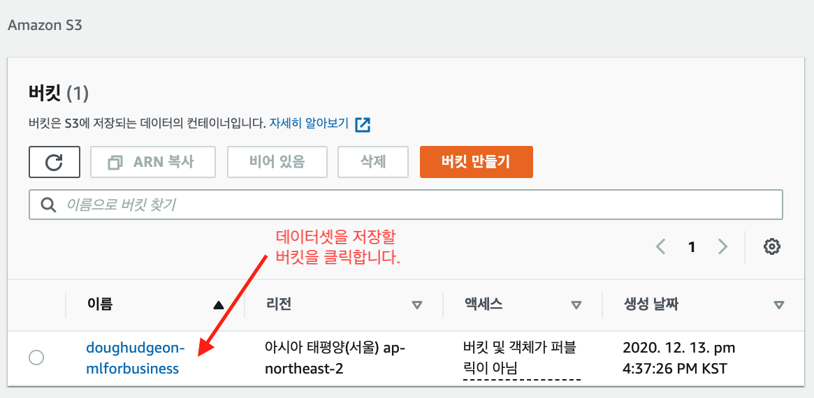

이 책에서는 S3 에 버킷을 생성한 뒤 그곳에 작업에 필요한 각 데이터셋을 저장할 폴더를 생성합니다. 이런 과정은 모든 작업에 있어서 좋은 습관입니다. 버킷을 사용하여 액세스 권한이 있는 사람에 따라 작업을 분리하고 폴더를 구분하여 데이터셋을 분리합니다.

## **B.1 S3에서 버킷 생성 및 설정**

버킷을 디렉터리의 최상위 폴더라고 생각하면 됩니다. AWS 버킷 이름은 전 세계적으로 고유합니다. 즉, 다른 사람이 만든 버킷 이름과 같을 수 없습니다. 이것의 장점은 웹에서 접근할 수 있는 고유한 주소를 각 버킷에 할당할 수 있고 버킷 이름을 아는 모든 사람이 해당 버킷을 탐색 할 수 있다는 것입니다(물론 버킷과 그 안에 들어 있는 내용을 확인하기 위해서는 버킷에 대한 액세스 권한을 가지고 있어야 합니다).

새 계정에서 S3 서비스를 처음 접근하면 `버킷 없음` 이라고 표시됩니다 (그림 B-2).

**그림 B-2** S3버킷을 생성하기 전 대시보드

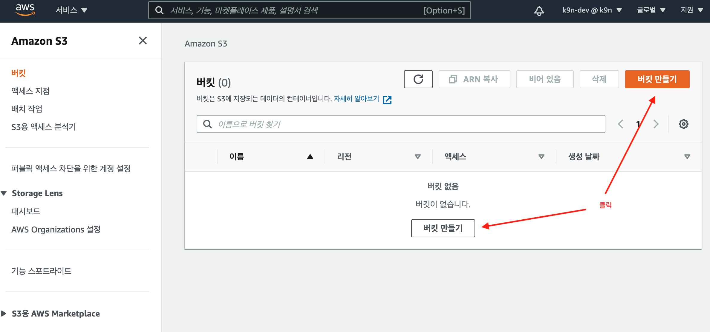

여러분의 첫 번째 버킷을 생성하려면 버킷 만들기를 클릭합니다. 이 후 버킷에 대한 설정을 할 수 있습니다.

*Amazon S3 콘솔 UI가 업데이트 된 후 버킷 생성 마법사의 단계가 간편화되었습니다.* **`버킷 만들기`** *를 클릭한 후 세부 사항을 모두 설정할 수 있으며 이 후 바로 버킷이 생성됩니다. 여기서는 세부 사항에 대해서 간단하게 설명합니다.*

### B.1.1 버킷 이름 지정

[그림 B-3]은 버킷의 이름을 입력하고 리전을 지정합니다.

**그림 B-3** 버킷 생성: 이름과 리전 지정

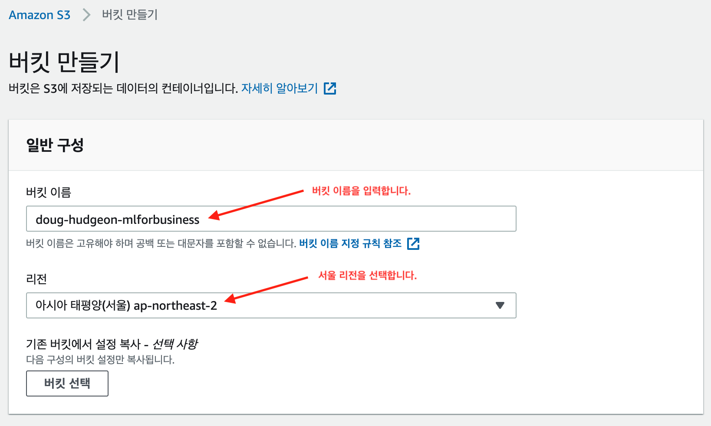

이 단계에서는 버킷의 이름을 지정하고 생성될 버킷이 위치할 원하는 리전을 선택합니다. 이 책의 예제 수행을 위해 `mlforbusiness` 를 포함한 고유한 버킷 이름(예를 들면 자신의 영문 이름을 사용해서)을 만듭니다. 누군가 이미 같은 이름의 버킷을 만든 경우 이름 뒤에 임의의 숫자를 추가해야 할 수도 있습니다.

**NOTE_** 버킷 이름에는 웹 주소에 입력할 수 있는 문자만 포함할 수 있습니다. 즉, 공백은 포함할 수 없습니다. 일반적으로 대시(-)를 사용하여 단어를 구분합니다.

리전은 AWS 서버의 물리적인 위치를 나타냅니다. 리전을 아시아 태평양(서울) ap-northeast-2로 변경합니다. 현재(2020년 12월) AWS의 세이지메이커의 대분의 기능은 서울 리전에서 수행이 가능하며 이 책의 설명하는 기능 모두 사용 가능합니다. 세이지메이커 예세 수행 시에도 지역을 확인하고 예제를 수행해야 합니다 (그림 B-4).

**그림 B-4** 세이지메이커 리전 확인: 서울로 되어 있는지 확인한 후 예제를 수행합니다.

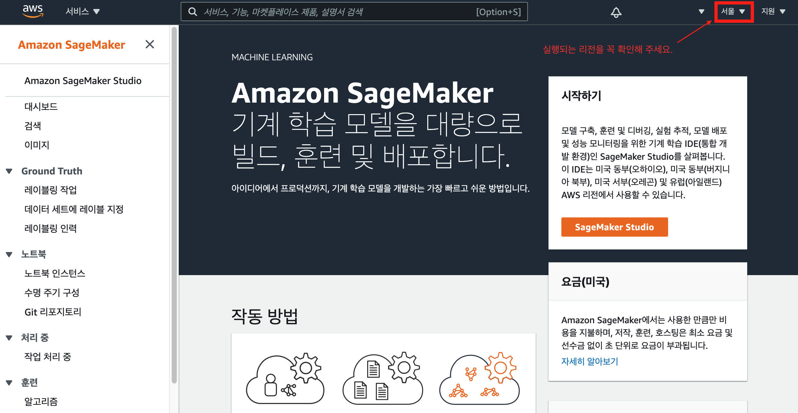

이 단계의 설정 후 하단의 `버킷 만들기` 버튼을 클릭하면 버킷이 생성됩니다.

아래 설명하는 내용은 책의 예제 수행과는 관계없는 세부 설정에 대한 설명이니 넘어가도 좋습니다.

### B.1.2 버킷 속성 설정: 퍼블릭 액세스 차단을 위한 버킷 설정 및 버전 관리

이름과 리전을 설정 후 페이지를 스크롤하면 버킷을 관리하기 위한 다양한 정책을 설정할 수 있습니다.

버킷을 외부에서 접근하는 정책을 설정하는 항목입니다. 이 책의 예제는 AWS의 IAM 서비스를 통한 인증과정을 후 버킷을 사용하므로 해당 사항은 기본 설정인 `모든퍼블릭 액세스 차단`을 확인 후 다음항목으로 진행합니다 (그림 B-5).

**그림 B-5**  퍼블릭 액세스 차단 및 버킷 버전 관리 설정

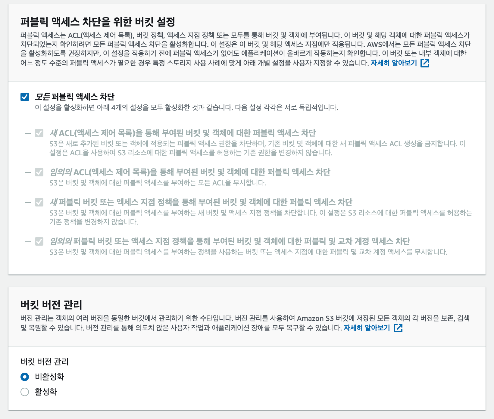

`버킷 버전 관리`는 버킷에 저장된 파일에 대한 변경 관리가 가능하게 합니다. 즉, 파일을 수정 후에도 과거의 상태로 되될릴 수 있습니다. 이는 추가적인 비용을 발생시키므로 여기서는 기본 설정인 비활성화를 선택합니다.

### B.1.3 버킷 속성 설정: 태그 및 기본 암호화 설정

그 다음 항목을 `태그`입니다. 이는 버킷이 다수개가 되고 사용하는 사람이 많아지면 관리의 어려움이 있을 수 있기 때문에 태그(메타)를 키와 값으로 입력해 좀 더 쉽게 관리할 수 있도록 합니다 (검색 시 유용).

`기본 암호화` 항목은 버킷을 암호화 해 데이터를 보호하는 방법입니다. 활성화 해 설정할 경우 모든 파일(객체)이 암호화 키를 통해 암호화한 후 저장되게 됩니다. 물론 저장된 파일(객체)은 암호화 키를 통해 복호화한 후 데이터를 읽을 수 있습니다. 이 책의 예제에서는 설명 범위에서 벗어나므로 해당 설정은 `비활성화`를 선택합니다.

**그림 B-6** 태그 및 기본 암호화 설정

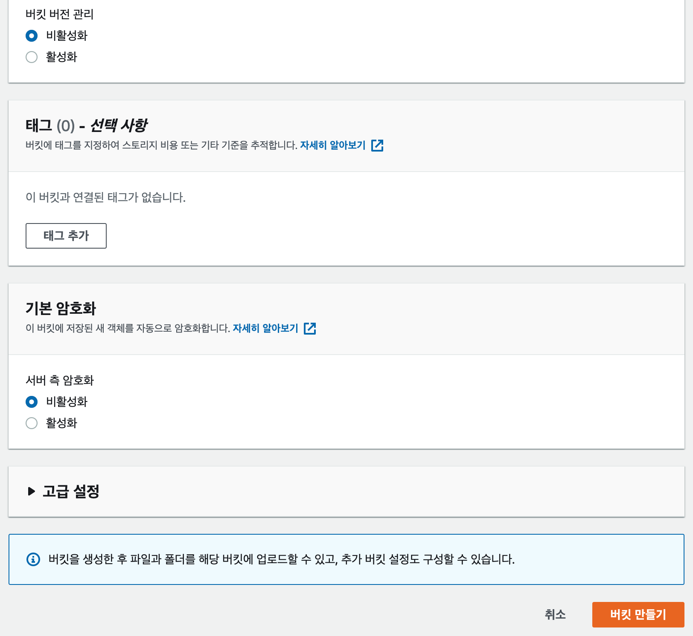

### B.1.4 버킷 만들기

모든 설정을 확인했으므로 [그림 B-6]의 우측 하단의 `버킷 만들기` 를 클릭합니다.

[그림 B-7]은 방금 생성한 버킷을 보여줍니다. 버킷을 설정했으므로 이제 버킷에 폴더를 설정할 수 있습니다.

**그림 B-7** 방금 만든 버킷을 포함한 S3의 버킷 목록

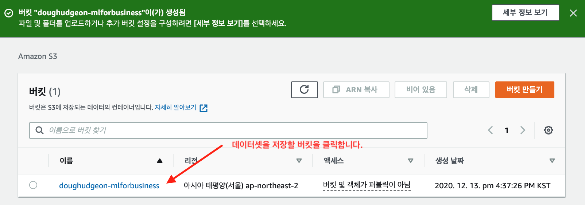

## B.2 S3에 폴더 설정

앞 절에서 이 책의 모든 파일과 코드를 보관할 버킷을 만들었습니다. 이 절에서는 2 장의 파일과 코드를 보관할 폴더를 설정합니다. 일단 익숙해지면 다른 장의 폴더도 쉽게 설정할 수 있습니다.

S3 의 버킷을 최상위 폴더로 생각할 수 있습니다. 여기서 만들 폴더는 최상위 폴더인 버킷의 하위 폴더입니다.

이 책에서는 버킷의 내용을 설명할 때 ‘폴더’라는 용어를 사용해서 설명했지만 사실 정확한 용어는 아닙니다. 실제로 S3 버킷에는 폴더가 존재하지 않습니다. 사용자 인터페이스에는 폴더가 있는 것처럼 보이지만 S3 버킷은 실제로 파일을 계층적(폴더 구조)으로 저장하지 않습니다.

S3의 버킷은 쉽게 접근을 제한할 수 있는 웹상의 특정 위치라고 하는 것이 더 정확합니다. S3 버킷에 있는 모든 파일은 물리적으로 버킷의 최상위 수준에 위치합니다. S3 에서 폴더를 생성하면 폴더처럼 보이지만 단순히 폴더처럼 보이는 방식으로 이름이 붙여진 버킷의 최상위 수준에 저장된 파일일 뿐입니다.

예를 들어 부록 B에서 설정한 버킷에 `ch02` 폴더를 만들고 여기에 `orders_with_predicted_value.csv` 라는 파일을 넣을 것입니다. 이것은 실제로는 버킷에 해당 이름의 파일을 생성하는 것입니다. 보다 정확한 용어를 사용하려면 파일 이름이 **key** 이고 파일 내용이 **value** 입니다. 따 라서 버킷은 key / value 쌍을 저장하는 웹상의 위치를 나타내는 것뿐입니다.

작업하는 각 머신러닝 데이터셋에 대해 방금 생성한 버킷 내에 별도의 폴더를 생성할 것입니다. 우선 [그림 B-8]과 같이 `폴더 만들기` 를 클릭합니다.

**그림 B-8** S3에 폴더 생성

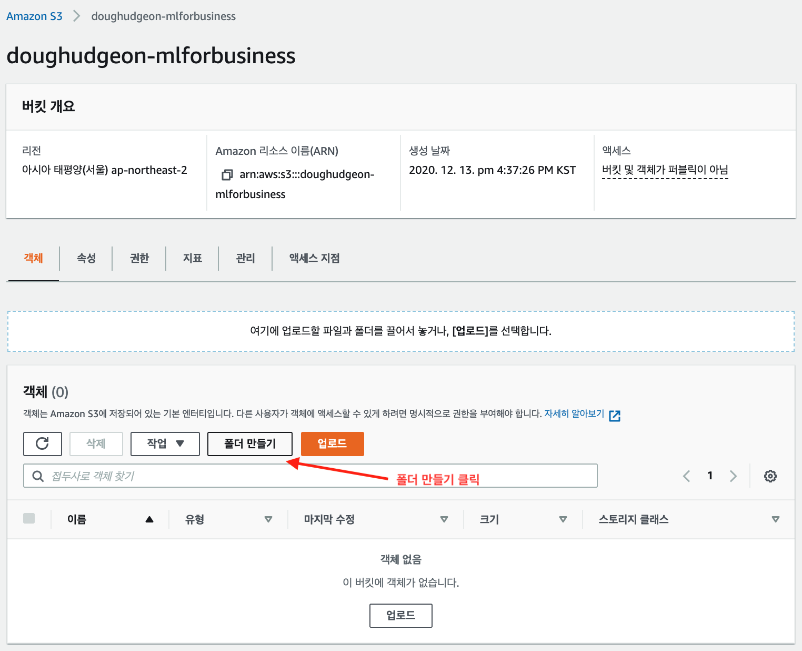

[그림 B-9]와 같은 화면이 나타나면 폴더 이름을 `ch02` 로 지정하고 `폴더 만들기` 를 클릭합니다.

**그림 B-9** S3의 폴더 이름 지정

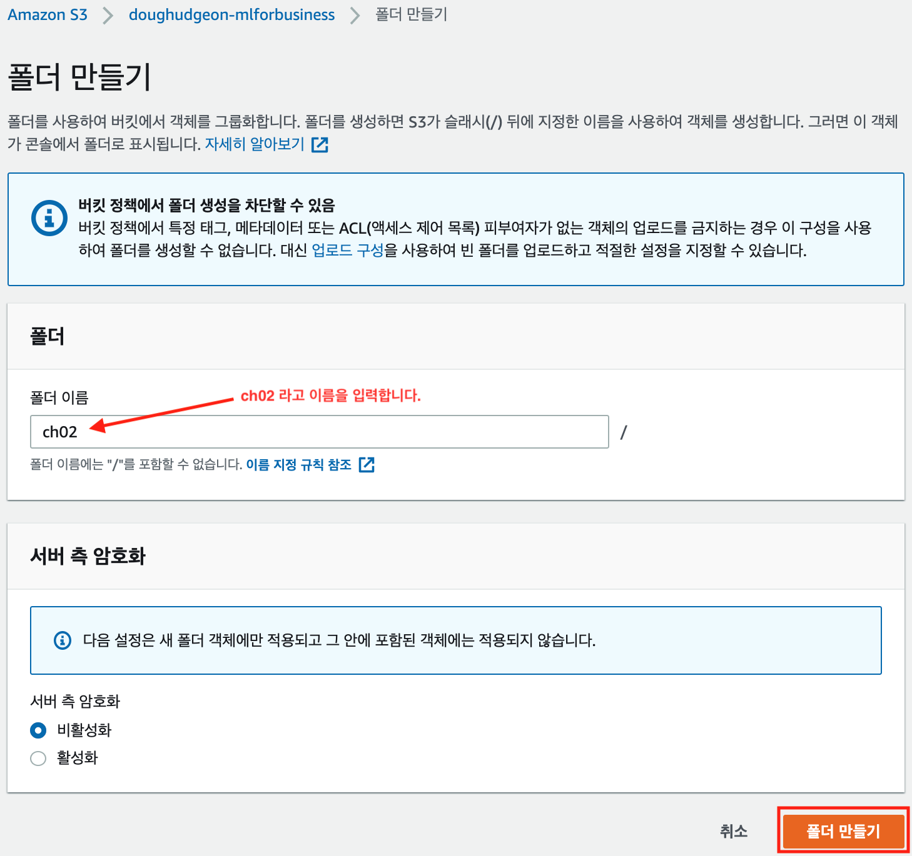

S3 페이지로 돌아오면 방금 만든 버킷에 있고 [그림 B-10]에 표시된 대로 `ch02` 라는 폴더를 확인할 수 있습니다.

**그림 B-10** 새로 생성한 `ch02` 폴더

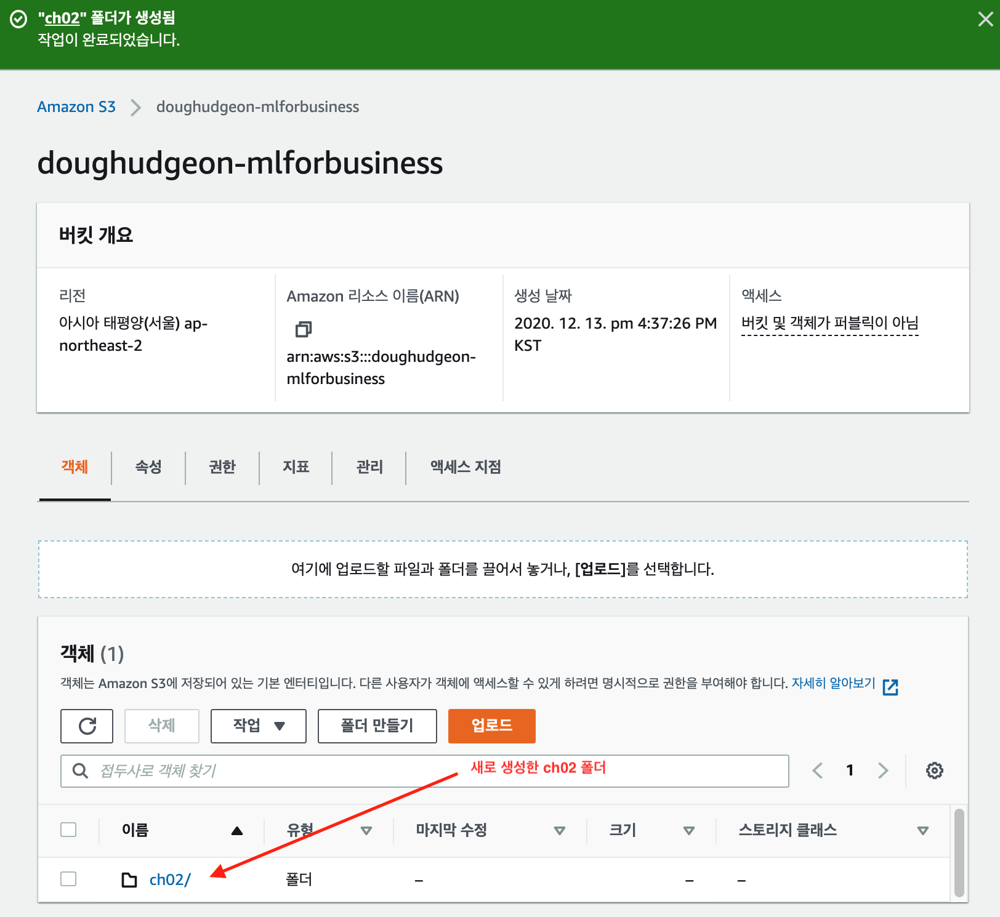

이제 S3 버킷에 폴더가 생성되었으므로 데이터 파일을 업로드하고 세이지메이커에서 예측 모델 설정 작업을 시작할 수 있습니다.

## B.3 S3에 파일 업로드

데이터 파일을 업로드하려면 먼저 다음 링크에서 데이터 파일을 다운로드하세요.

  https://s3.amazonaws.com/mlforbusiness/ch02/orders_with_predicted_value.csv 

그런 다음 `ch02` 폴더로 이동하고 업로드 버튼을 클릭하여 데이터 파일을 `ch02` 폴더에 업로드 하세요 (그림 B-11).

**그림 B-11** 데이터를 S3에 업로드

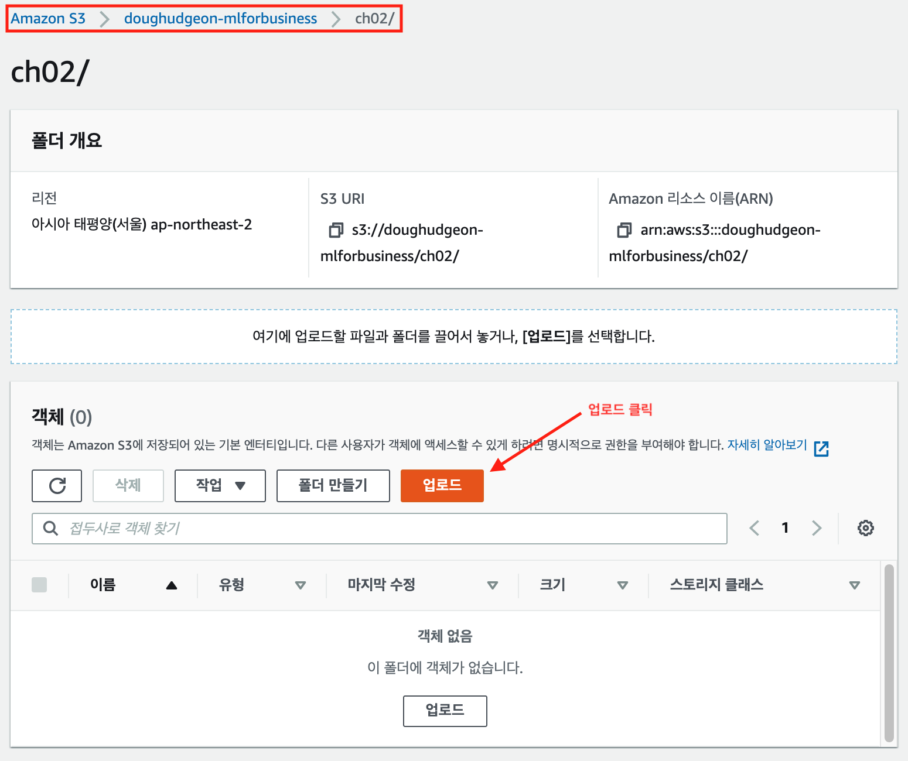

파일을 업로드하면 S3 에 표시됩니다 (그림 B-12).

**그림 B-12**  S3의 데이터셋 목록

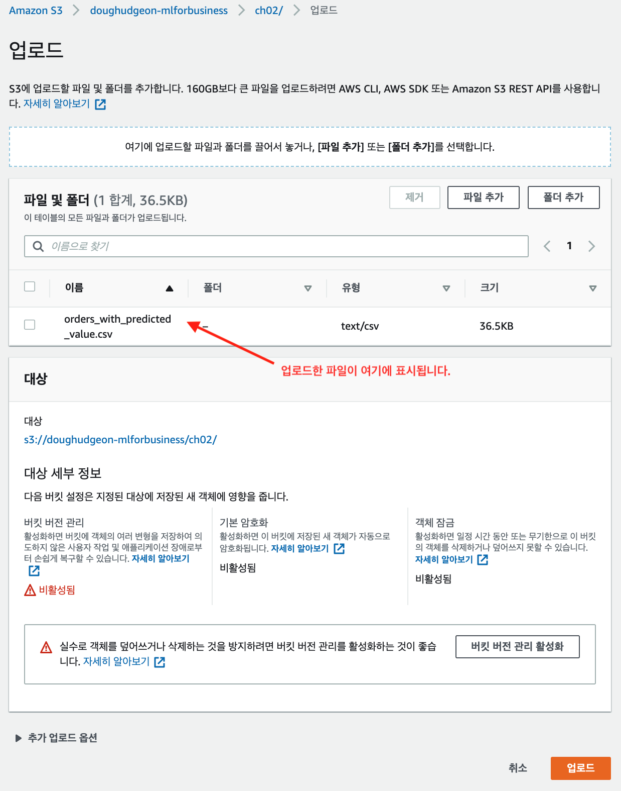

다시 책으로 돌아가 **부록 C** 에서 AWS 의 세이지메이커를 설정하는 방법을 배웁니다.

